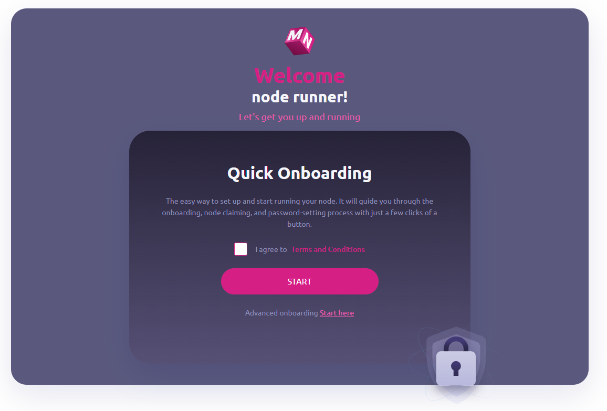
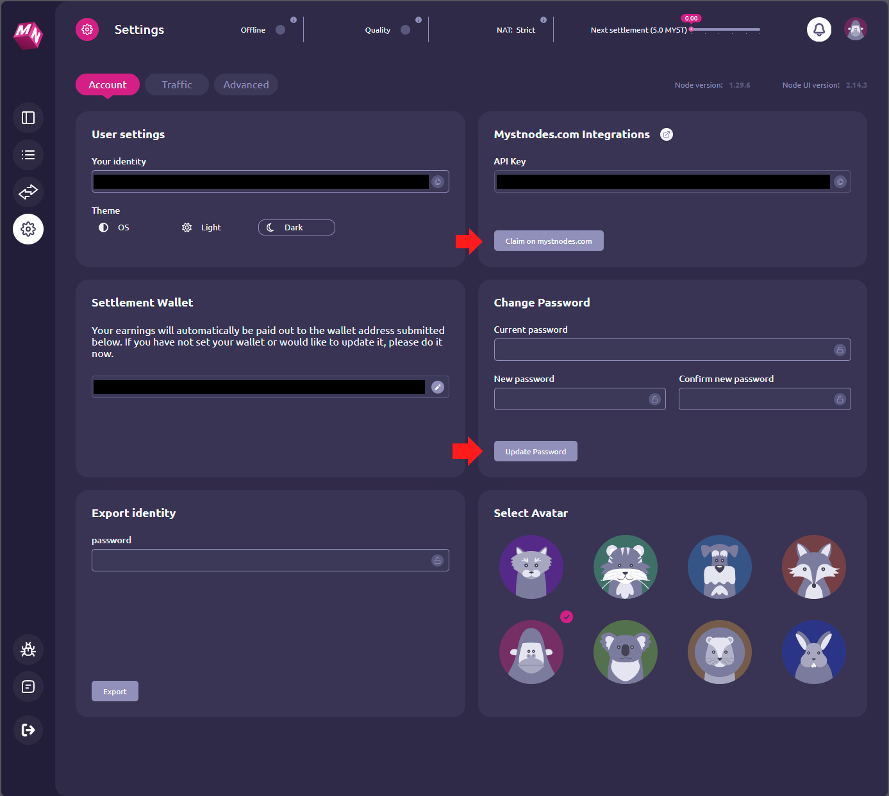

# MYSTERIUM CONSUMER NODE - Docker, Mysterium, Tequila API, Python

Goal: Use "Mysterium Node" in docker with the "Tequila API" with the goal of running Selenium and other Python scripts that can resedentially "ip-hop" as needed on the Mysterium Consumer Network.

### 1. Create Project Root:
root folder named
> /mysterium/


### 2. Create .env file:
- Create a local enviromental file called *.env* and place it in the *Mysterium* root folder.
> /mysterium/.env
- Remember to add this to your .gitignore file.
```python
# This is the password you use to login to your Mysterium account.
Mysterium_PASSPHRASE="YOUR_Mysterium_NODE_PASSWORD_GOES_HERE" 
# This is the username you use to SET and login to your Tequila API.
TEQUILAPI_USERNAME="ASSIGN_ANY_USER_NAME_YOU_WANT_HERE"
# This is the password you use to SET and login to your Tequila API.
TEQUILAPI_PASSWORD="ASSIGN_ANY_SECURE_PASSWORD_NAME_YOU_WANT_HERE" 
```
<br>

### 3. Docker Compose:
- Create a docker compose file called *docker-compose.yml* and place it in the */mysterium/* root folder.

> /mysterium/docker-compose.yml 

```yml
version: '3.0' # Compose file version

services:
  Mysterium-proxy: # Service name
    
    image: Mysteriumnetwork/myst:latest # Docker image
    
    ports: # Exposes ports to the host machine.
      - 44449:44449 # http://localhost:44449 - Mysterium Node UI access 
      - 4050:4050 # http://localhost:4050 - TequilAPI access
      - 40001:40001 # http://localhost:40001 - Unspecified usage 
    
    cap_add: # Adds Linux capabilities.
      - NET_ADMIN # The Linux NET_ADMIN capability is required for creating VPN tunnels.

    command: '--tequilapi.auth.username=${TEQUILAPI_USERNAME} --tequilapi.auth.password=${TEQUILAPI_PASSWORD} --tequilapi.address=0.0.0.0 --tequilapi.port=4050 --ui.port=44449 --proxymode daemon' # Specifies the command to execute when the container starts. This command starts the Mysterium node with specific parameters for the TequilAPI and the UI.

    volumes: # Mounts host paths or named volumes.
      - ./myst-data:/var/lib/Mysterium-node # Maps data storage # Maps the 'myst-data' directory from the host to '/var/lib/Mysterium-node' inside the container. This is where the Mysterium node stores its data.
 ```

1. Open the `/mysterium/` root folder in the terminal and run the `docker-compose up -d` *command* to start the docker container.
2. Check the new docker container is running with the `docker ps -a` *command*. If you're using docker desktop on windows you should also now see it under the "containers tab" in docker desktop.

### 4. Confirm Mysterium UI is now running through docker:
- Verify Mysterium is running correctly in the container by visitng the UI port at http://localhost:44449 <br>
If the docker container was installed correctly you should see the following screen:

 <br>
Click *START* and begin the automatic onboarding process. When you are done the UI will provide you a password for accessing your Mysterium node. DO NOT LOSE THIS. You can change it in the next step.

### 5. Claim your node on mystnodes.com:
- Once the Mysterium Node Dashboard has loaded - head over to the settings page by clicking the settings icon or visiting http://localhost:44449/#/settings.

<br>
Find the `Claim on mystnodes.com` button on this settings page and click it to claim your node. You can also update the default password from the last step on this settings page.

### 6. Query your myst account info:
- First get the Mysterium node docker *CONTAINER ID* with the `docker ps -a` *command*.

- Then use the following command to check your myst account status and wallet balance: <br>
    ```docker exec -ti Docker_Container_ID_Goes_Here myst account info``` <br>
    Make sure to repalce the Docker_Container_ID_Goes_Here with your actual docker container id in the command above. <br>
You should now recieve the general output:
```python
[INFO] Using identity:0x0000000000000000000000000000000000000000 #Omitted address with 0's
[INFO] Registration Status:Registered
[INFO] Channel address:0x000000000000000000000000000000000000000 #Omitted address with 0's
[INFO] Balance: 0.000000
```
- If you have a balance of 0.000000 you will need to fund your Mysterium node contract/wallet to be able to use Mysterium consumer services through the Tequila API. This is referenced by the *"Channel address"* in the output above, so we need to fund the *"Channel Address"* with the *$MYST* token on the *Polygon Network*.

### 7. Fund your Mysterium Node contract's channel address.

On the Polygon network. Fund your Polygon wallet with the native *$MATIC* token. Then on Quickswap fund your wallet with *$MYST* by swapping *$MATIC > $MYST*.

- The official $MYST token address on Polygon is: `0x1379e8886a944d2d9d440b3d88df536aea08d9f3` <br>
- Reference: https://help.mystnodes.com/en/articles/8004186-adding-myst-token-to-metamask-on-the-polygon-mainnet <br>
- Direct swap url: https://quickswap.exchange/#/swap?swapIndex=0&currency0=ETH&currency1=0x1379E8886A944d2D9d440b3d88DF536Aea08d9F3

With *$MYST* token in your wallet you can now send *$MYST* to your Mysterium Node contract's channel address. (The wallet for your mysterium node). <br>REMEMBER: *The Channel address is referenced in the output from the `docker exec -ti Docker_Container_ID_Goes_Here myst account info` command.* 

After confirming the tokens have been sent correctly on the block explorer. Re-run the `docker exec -ti Docker_Container_ID_Goes_Here myst account info` docker command to re-check your balance. If its still 0.000000 you can force it to refetch the balance by re-starting the node/docker container or by executing the following docker command:

Force refresh the balance:
```
docker exec -ti $containername_1 myst cli --agreed-terms-and-conditions 
```
Then re-check the balance again. If its still 0.000000 wait 5 minutes and try again. If it still doesnt show you prob did something wrong.

